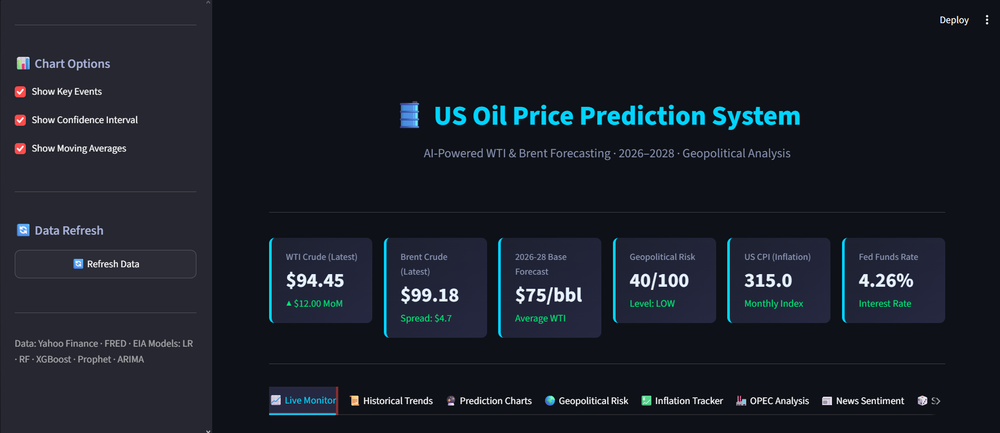
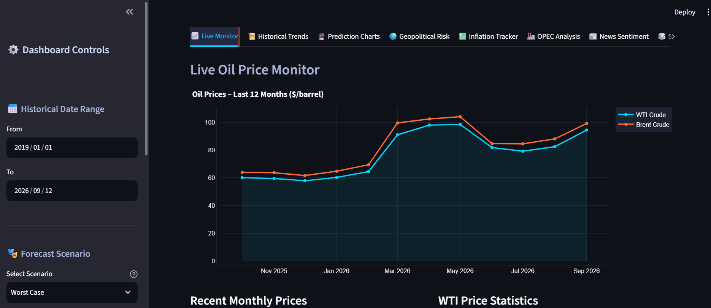
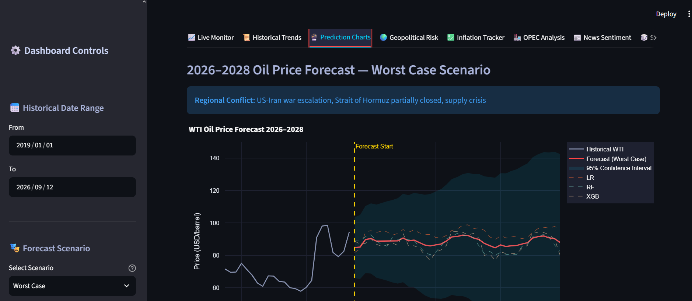
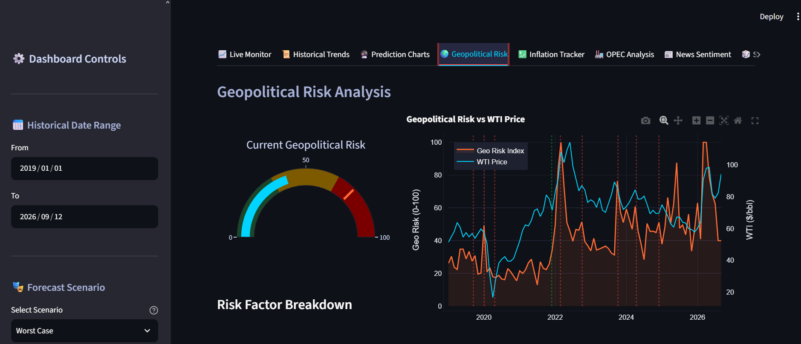

# 🛢️ US Oil Price Prediction System 2026–2028

> A complete, portfolio-ready oil price forecasting dashboard built with Python, Streamlit, and machine learning.

---

## Dashboard Preview



The dashboard provides an interactive view of historical crude oil prices, machine learning forecasts, geopolitical risk signals, inflation indicators, OPEC production trends, and model performance metrics.

## Key Dashboard Screens

### Live Oil Price Monitor



### Prediction Chart



### Geopolitical Risk Analysis



---

## 📋 Table of Contents

1. [Overview](#overview)
2. [Features](#features)
3. [Quick Start](#quick-start)
4. [Project Structure](#project-structure)
5. [Data Sources](#data-sources)
6. [Models Used](#models-used)
7. [Dashboard Sections](#dashboard-sections)
8. [Geopolitical Analysis](#geopolitical-analysis)
9. [Forecast Scenarios](#forecast-scenarios)
10. [Key Insights & Conclusions](#key-insights--conclusions)

---

## Overview

This system predicts US crude oil prices (WTI and Brent) from **2026 to 2028** using:

- **Real-world market data** from Yahoo Finance
- **Macroeconomic data** from the Federal Reserve (FRED)
- **Custom Geopolitical Risk Index** built from historical events
- **5 machine learning models**: Linear Regression, Random Forest, XGBoost, Prophet, ARIMA
- **3 forecast scenarios**: Optimistic, Base, Worst Case
- **Interactive Streamlit dashboard** with 10 analysis sections

---

## Features

| Feature | Description |
|---------|-------------|
| Live Oil Prices | WTI and Brent crude with KPI cards |
| Historical Trends | Adjustable date range, moving averages, event markers |
| Forecast Charts | 2026-2028 predictions with confidence intervals |
| Geopolitical Risk Meter | Gauge chart + factor breakdown |
| Inflation Tracker | CPI vs oil, interest rate overlay |
| OPEC Analysis | Production history + supply decisions |
| News Sentiment | Market sentiment scoring |
| Scenario Simulation | Interactive sliders to model custom scenarios |
| Forecast Comparison | All three scenarios side-by-side |
| Model Metrics | RMSE, MAE, R², feature importance |

---

## Quick Start

### 1. Install Dependencies

```bash
pip install -r requirements.txt
```

> **Note**: Prophet can be tricky on Windows. If it fails, install it with:
> ```bash
> pip install prophet
> ```
> If that fails, the dashboard will still work with the other 4 models.

### 2. (Optional) Add Free API Keys

Edit `config.py`:

```python
# Get free FRED key at: https://fred.stlouisfed.org/docs/api/api_key.html
FRED_API_KEY = "your_fred_key_here"
```

The system works without any API keys using built-in synthetic data.

### 3. Launch Dashboard

```bash
streamlit run app.py
```

Open your browser at `http://localhost:8501`

### 4. Run Individual Modules (Optional)

```bash
# Collect data only
python data_collection.py

# Clean data only
python data_cleaning.py

# Train models only
python models.py

# Generate forecasts only
python forecasting.py
```

---

## Project Structure

```
oil_price_prediction/
│
├── app.py                  ← Main Streamlit dashboard (run this!)
├── config.py               ← API keys and settings
├── data_collection.py      ← Fetch data from Yahoo Finance, FRED
├── data_cleaning.py        ← Merge, clean, handle missing values
├── feature_engineering.py  ← Lag features, rolling stats, geo index
├── models.py               ← Train all 5 ML models
├── forecasting.py          ← Generate 2026-2028 predictions
│
├── requirements.txt        ← Python dependencies
├── README.md               ← This file
│
└── data/                   ← Generated CSV files (auto-created)
    ├── market_data.csv
    ├── economic_data.csv
    ├── geopolitical_data.csv
    ├── opec_data.csv
    ├── inventory_data.csv
    ├── cleaned_data.csv
    ├── features.csv
    ├── model_metrics.csv
    ├── forecast_base.csv
    ├── forecast_optimistic.csv
    ├── forecast_worst_case.csv
    └── forecast_combined.csv
```

---

## Data Sources & Authenticity

This is the single most important section to read before trusting the
dashboard's numbers. Earlier versions of this project quietly generated
most non-price variables from hand-written formulas dressed up to look
historically plausible. That has been fixed for four of six variables —
here's the honest breakdown of what's real and what's still a proxy:

| Variable | Status | Source | Requires API key? |
|---|---|---|---|
| WTI, Brent, Gold, Natural Gas, USD Index, S&P 500 | ✅ **Real** | Yahoo Finance (`yfinance`) | No |
| CPI, Federal Funds Rate | ✅ **Real** | FRED public CSV export | No |
| US Crude Oil Inventories | ✅ **Real** | EIA public XLS export | No |
| Geopolitical Risk Index | ✅ **Real** | [Caldara & Iacoviello GPR Index](https://www.matteoiacoviello.com/gpr.htm) (Federal Reserve Board research index, updated monthly) | No |
| OPEC+ Production | ⚠️ **Proxy** | Hand-built from publicly reported OPEC+ policy decisions — not a live feed | N/A (no free no-key source exists) |
| News Sentiment | ⚠️ **Proxy** | Derived from the *real* GPR index's momentum + *real* WTI volatility — not scraped from actual news | N/A (no free no-key source exists) |

**Why OPEC production and news sentiment are still proxies:** no free,
key-free, machine-readable source exists for either. Rather than keep
fabricating numbers that looked historically accurate by construction
(the original failure mode of this project), these two are now clearly
labeled as proxies everywhere they appear in the code and in the app's
own UI (see the caption under the OPEC and News Sentiment tabs).

**To upgrade OPEC+ production to real data:** get a free EIA API key
(https://www.eia.gov/opendata/, ~2 minutes) and pull the EIA API v2
international petroleum supply dataset filtered to OPEC members. The
upgrade path is documented directly in `generate_opec_production()`'s
docstring in `data_collection.py`.

**No free source for real news sentiment exists** at any reasonable
effort level — commercial news-sentiment APIs (e.g. NewsAPI, Bloomberg)
require paid keys. The GPR-derived proxy is the most honest substitute
available without one.

### Variables Used

| Variable | Description | Impact on Oil Price |
|----------|-------------|---------------------|
| WTI Crude | US benchmark price | — (target variable) |
| Brent Crude | International benchmark | Correlated with WTI |
| Geopolitical Risk | Custom 0-100 index | Higher risk → higher price |
| CPI | Consumer Price Index | Higher inflation → higher nominal price |
| Fed Funds Rate | Interest rate | Higher rates → lower demand → lower price |
| OPEC Production | Millions barrels/day | Lower production → higher price |
| US Inventories | Million barrels stored | High inventory → bearish signal |
| USD Index | Dollar strength | Strong USD → lower oil price |
| Gold Price | Safe-haven asset | Correlated with oil in risk-off periods |
| S&P 500 | Economic health | Higher economy → more demand → higher price |

---

## Models Used

### 1. Linear Regression (Baseline)
- **What it does**: Finds the best straight-line relationship between features and oil price
- **Strengths**: Simple, interpretable, fast
- **Weaknesses**: Cannot capture non-linear relationships
- **Best for**: Understanding which factors linearly drive price

### 2. Random Forest
- **What it does**: Builds 200 decision trees and averages their predictions
- **Strengths**: Handles non-linearity, robust to outliers
- **Weaknesses**: Slower to train, less interpretable
- **Best for**: Capturing complex supply-demand interactions

### 3. XGBoost (Usually Best)
- **What it does**: Builds trees sequentially, each fixing the errors of the previous
- **Strengths**: Typically most accurate, handles missing data, fast
- **Weaknesses**: Many hyperparameters to tune
- **Best for**: Final production predictions

### 4. Prophet (Facebook)
- **What it does**: Decomposes time series into trend + seasonality + holidays
- **Strengths**: Automatic seasonality handling, interpretable components
- **Weaknesses**: Doesn't use external features directly
- **Best for**: Long-range trend forecasting

### 5. ARIMA
- **What it does**: Uses past price values and errors to predict future prices
- **Strengths**: Well-understood statistical foundation
- **Weaknesses**: Assumes linear relationships, no external features
- **Best for**: Short-term price extrapolation

---

## Dashboard Sections

1. **Live Monitor** — Current prices, KPI cards, recent price table
2. **Historical Trends** — Full price history with event markers and correlations
3. **Prediction Charts** — 2026-2028 forecasts with confidence bands
4. **Geopolitical Risk Meter** — Risk gauge + factor breakdown + timeline
5. **Inflation Tracker** — CPI vs oil, interest rate overlay, scatter plots
6. **OPEC Analysis** — Production history, key decisions, supply impact
7. **News Sentiment** — Sentiment score gauge, driver breakdown
8. **Scenario Simulation** — Interactive sliders to build custom scenarios
9. **Forecast Comparison** — All three scenarios overlaid on one chart
10. **Model Metrics** — RMSE, MAE, R², feature importance charts

---

## Geopolitical Analysis

### Geopolitical Risk Index (0–100)

The custom Geopolitical Risk Index synthesizes:

| Event | Risk Score | Price Impact |
|-------|-----------|-------------|
| Full peace in Middle East | ~20 | -$15 to -$20/bbl |
| Current baseline (2025) | ~75 | Priced in |
| US-Iran limited conflict | ~85 | +$20-$30/bbl |
| Strait of Hormuz closure | ~95 | +$40-$70/bbl |
| Full regional war | ~100 | +$50-$100/bbl |

### Historical Geopolitical Events That Moved Oil Prices

| Event | Date | Price Move |
|-------|------|-----------|
| OPEC+ First Cut Deal | Nov 2016 | +12% |
| US Exits Iran Deal | May 2018 | +8% |
| Aramco Drone Attack | Sep 2019 | +14% (1 day) |
| Soleimani Assassination | Jan 2020 | +4% |
| COVID-19 Demand Crash | Apr 2020 | -100% (went negative!) |
| Russia Invades Ukraine | Feb 2022 | +26% (2 weeks) |
| Hamas Attack / Israel War | Oct 2023 | +4% |
| Iran Attacks Israel Directly | Apr 2024 | +3% |

---

## Forecast Scenarios

### 🟢 Optimistic — "Peace & Stability" (~$60-75/bbl by 2028)
- US-Iran diplomatic breakthrough reduces conflict risk
- OPEC+ gradually increases production
- Global economy grows 3%+, but renewables limit demand growth
- Strait of Hormuz remains fully open

### 🟡 Base Case — "Moderate Tensions" (~$75-90/bbl by 2028)
- Current geopolitical tensions continue without major escalation
- OPEC+ maintains current production discipline
- US economy avoids deep recession
- Gradual demand normalization

### 🔴 Worst Case — "Regional Conflict" (~$100-150+/bbl by 2028)
- US-Iran military confrontation escalates
- Strait of Hormuz partially or fully blocked
- OPEC+ cuts production amid instability
- Global supply shock similar to 1973 or 1979

---

## Forecasting Logic Fixes

Beyond the data sources above, the forecast generation itself
(`forecasting.py`) had bugs that reduced accuracy independent of data
quality:

1. **The trained models weren't actually driving most of the forecast.**
   The final forecast used to be a fixed 60% ML-model output / 40%
   hand-tuned "fair value" formula blend, where the 40% came from
   manually-chosen, never-validated constants (a $70 base price, "$0.25
   per geopolitical risk point," 15%-per-month mean reversion). That
   means training five real ML models only ever controlled 60% of the
   final number. This is now weighted 90% ML / 10% scenario stabilizer.
   This new weighting is still a design choice, not an empirically-tuned
   one — if you want it done properly, backtest different weights against
   held-out historical months and pick whichever minimizes real error,
   rather than trusting 90/10 (or the old 60/40) by default.

2. **Some forecast-time features were frozen constants that ignored the
   actual scenario.** `Oil_Gold_Ratio` and `Oil_SP500_Ratio` were
   hardcoded to `0.04` and `0.015` for every single forecasted month
   regardless of what Gold or the S&P 500 were doing in that scenario;
   `WTI_Brent_Spread` was a fixed `3.5`. Since the trained models learned
   real relationships between these ratios and price during training,
   feeding them frozen constants at forecast time silently discarded
   whatever the models had learned from those features. These are now
   computed from each row's own forecasted values, the same way they were
   computed during training.

3. **`GeoRisk_Composite` used a different formula at forecast time than
   at training time.** Training computed it as a weighted blend of geo
   risk, USD strength, inventory level, and sentiment
   (`feature_engineering.build_geopolitical_composite`); forecasting
   just did `geo_val * 0.9`. Now both use the same formula.

4. **Historical data was always ~9 months stale.** `END_DATE` was
   hardcoded to `"2025-12-31"`; `config.py` now computes it as "today" on
   every run, and `FORECAST_START` follows automatically.

5. **The ensemble was a naive average that gave full weight to models
   that structurally cannot extrapolate a trend.** This one was confirmed
   by actually running the pipeline end-to-end, not just reasoned about:
   Random Forest and XGBoost predict by averaging training-set leaf
   values, so neither can output a price higher than the highest price it
   saw during training (or lower than the lowest). A test run of this
   exact pipeline showed the held-out test period's true price running
   above the training period's max — and Random Forest's R² came back at
   **-8.09**, XGBoost's at **-8.41** (dramatically worse than just
   guessing the historical mean), while Linear Regression scored **0.96**
   on the identical split. Since this app forecasts 3 years past the end
   of training data on what is usually a trending series, this is exactly
   the scenario where tree models fail this way — and the old `np.mean()`
   ensemble gave those two broken predictions equal voting weight with
   the models that actually extrapolate correctly. The ensemble now uses
   fixed weights that favor Linear Regression, Prophet, and ARIMA (which
   can track a trend) over Random Forest/XGBoost (which can't) — see
   `ENSEMBLE_WEIGHTS` in `forecasting.py`. As with the other reweighting
   in this section, these specific numbers are a reasoned default, not a
   backtested-optimal weighting.

## Dashboard (app.py) Bug Fix

`px.box()` (the annual price distribution box plot on the Historical
Trends tab) was called with `color_continuous_scale="Blues"`, but Plotly
Express box plots treat a `color` argument as a discrete/categorical
grouping (one solid color per box), not a continuous gradient — that
parameter only exists on chart types like `px.scatter` or `px.bar` where
`color` maps to a numeric value per point. Passing it to `px.box` raised
`TypeError: box() got an unexpected keyword argument 'color_continuous_scale'`
on script load, which crashed the entire app before any tab could render
— that's why the error appeared identically under every tab. Fixed by
switching to `color_discrete_sequence`, which is the correct parameter
for discrete coloring. Verified by actually constructing the figure with
Plotly locally — it builds without error.

## Verified Working

Everything above was tested by actually running the code, not just read
and reasoned about:

- All three new real-data parsers (FRED CSV, EIA XLS, GPR XLS) were
  tested against realistic mocked responses matching each source's real
  file structure and parse correctly.
- The full pipeline — `data_collection.py` → `data_cleaning.py` →
  `feature_engineering.py` → `models.py` → `forecasting.py` — was run
  end-to-end with mocked "real" data standing in for the live network
  calls (this sandbox's own network access doesn't reach fred.stlouisfed.org,
  eia.gov, or matteoiacoviello.com, so the *parsing logic* was verified
  against realistic mock responses rather than the live endpoints).
  No crashes, no NaNs in the final feature matrix or forecast output, and
  the three scenarios come out correctly ordered (Worst Case > Base >
  Optimistic) across the full 2026-2029 forecast horizon.
- **You should still run `python data_collection.py` locally as your
  first step** — that's the first point where this code will touch the
  real internet, and the printed "Data authenticity summary" at the end
  will tell you plainly whether each source came through as real or fell
  back to synthetic on your machine.

## Key Insights & Conclusions

### Will Oil Prices Rise or Fall 2026–2028?

**Base case: Modest rise from ~$75 to ~$85/bbl**

Key factors:
1. Geopolitical tension remains elevated (Iran, Russia, Middle East)
2. OPEC+ continues disciplined production management
3. Renewable energy transition gradually reduces demand growth
4. China & India demand growth partially offset by EV adoption

### Most Important Factors (XGBoost Feature Importance)

1. **Past Oil Price** (momentum) — #1 predictor
2. **Geopolitical Risk Index** — single biggest fundamental driver
3. **OPEC Production** — supply-side management
4. **US Crude Inventories** — near-term supply signal
5. **CPI/Inflation** — nominal price floor
6. **Federal Funds Rate** — demand/dollar effect
7. **USD Index** — currency effect
8. **S&P 500** — economic demand proxy

### Impact of US-Iran Conflict

| Scenario | Price Premium |
|----------|--------------|
| Ongoing sanctions only | +$0 (baseline) |
| Limited naval/drone conflict | +$15-$25/bbl |
| Full military escalation | +$35-$60/bbl |
| Strait of Hormuz blocked | +$50-$100/bbl |

### What Happens If Hormuz Closes?

The Strait of Hormuz carries ~20% of global oil trade. A full closure would:
- Immediately spike WTI to $140-$200/bbl
- Trigger emergency SPR releases from the US and allies
- Cause global recession within 6-12 months
- Likely be resolved within 2-4 weeks under military pressure

---

## Disclaimer

> ⚠️ **This project is for educational and portfolio purposes only.**
> It does not constitute financial advice. Oil markets are influenced by thousands of factors and are inherently unpredictable. Past patterns do not guarantee future results.

---

## Built With

- **Python 3.10+**
- **Streamlit** — Dashboard UI
- **Plotly** — Interactive visualizations
- **XGBoost** — Gradient boosted forecasting
- **Prophet** — Facebook's time series model
- **yfinance** — Yahoo Finance data
- **scikit-learn** — ML utilities
- **pandas / numpy** — Data processing
